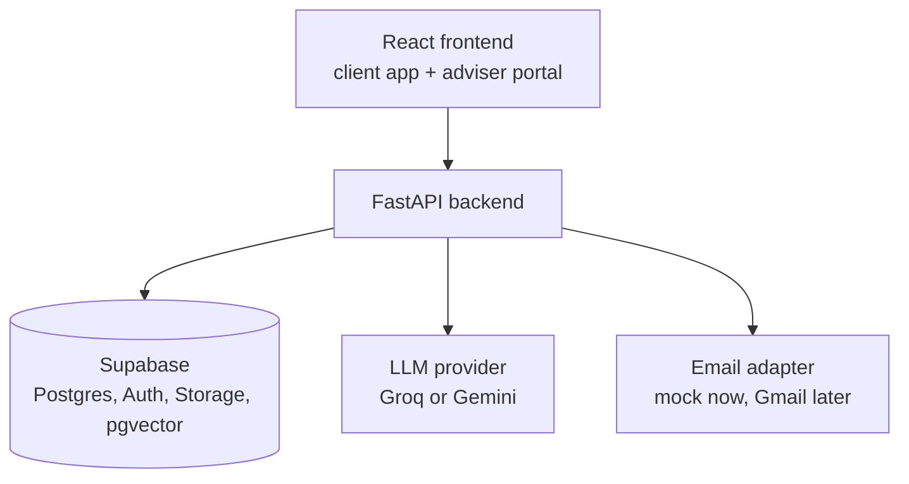

# Royal Square Platform

**A two-sided client and adviser platform for Royal Square Financial. Faster claims, clearer goals, automated reminders, and a document assistant that cites its sources.**

> Built for **AfriHack 2026** (Cape Town). Status: **in development, hackathon prototype**. All data in this repository is synthetic. Nothing here connects to Royal Square's production systems.

---

## The problem

Royal Square Financial is an independent brokerage and Financial Services Provider (FSP 29370) offering insurance and goal-based investments from major South African providers. Every client interaction generates admin: identity checks, record keeping, policy documents, renewals and claims. Advisers now spend more time on forms and searching documents than advising clients.

## What this platform does

One backend, two interfaces.

| For clients (mobile-friendly app) | For advisers (portal) |
|---|---|
| See policies, net worth, goals, open claims and reminders in one place | Manage assigned clients, the claims pipeline, goals and reminders |
| Report an accident and get an instant scene checklist | Update claim status and arrange logistics (hire car, repairs) |
| Register a motor claim with photos, licence and sketch | Ask questions of the firm's approved documents and get cited answers |
| Submit requests (address change, policy document, IRP5, consultation) | Surface and draft email replies linked to a claim (mock in the prototype) |

### Feature status

- [ ] Auth with client and advisor roles
- [ ] Client dashboard (policies, net worth, goals, claims, reminders)
- [ ] Goal tracking with progress bars
- [ ] Rule-based reminders
- [ ] Motor claims journey (accident checklist, claim registration, status timeline)
- [ ] Adviser claims pipeline
- [ ] RAG document assistant with document and page citations
- [ ] Client requests
- [ ] Email assistant (mock adapter; live Gmail is a post-hackathon goal)

## Demo story

1. A client taps **Report an Accident** and gets the scene checklist.
2. They register the claim with photos and documents.
3. The claim appears in the adviser's pipeline; the adviser updates its status and the client sees it.
4. The adviser asks the assistant a policy question and gets an answer with a document name and page number.
5. The adviser drafts the insurer email, linked to the claim.

## Architecture



Key decisions:

- All data access goes through the API. Roles come from a server-side profile, never from client-editable fields.
- Row-level security is enabled on all tables (default deny) as defence in depth.
- Retrieval uses pgvector inside Supabase, so no state lives on the API server's disk.
- The LLM sits behind a provider adapter so the model or vendor can change without touching business logic.
- Emails and documents are treated as untrusted input. The assistant drafts; a human sends.
- Reminders are computed on read (plus a manual "run check" endpoint), not by an in-process scheduler.

## Tech stack

| Layer | Technology |
|---|---|
| Frontend | React, TypeScript, Vite, Tailwind CSS, React Router, TanStack Query, React Hook Form |
| Backend | Python, FastAPI, Pydantic |
| Database, auth, storage | Supabase (PostgreSQL, Auth, Storage, pgvector) |
| LLM | Groq (primary), Gemini (fallback) |
| Hosting | Vercel (frontend), Render (backend) |

## Repository structure

```
royal-square-platform/
├── frontend/          # React app (client app + adviser portal, role-based routes)
├── backend/           # FastAPI service (routers, services, RAG, LLM and email adapters)
├── supabase/          # migrations: schema, RLS policies, pgvector
├── data/rag-docs/     # approved documents for retrieval (synthetic ones are labelled)
├── docs/              # PRD, architecture notes, demo script, decision log
├── scripts/           # helper scripts (e.g. keep-warm for the hosted backend)
├── AGENTS.md
├── CLAUDE.md
└── README.md
```

## Getting started

### Prerequisites

- Node.js (current LTS) and npm
- Python 3.11 or newer
- A Supabase project
- An API key for Groq and/or Gemini

### 1. Clone and configure

```bash
git clone <repo-url>
cd royal-square-platform
cp backend/.env.example backend/.env
cp frontend/.env.example frontend/.env
```

Fill in the values (see [Environment variables](#environment-variables)). Never commit `.env` files.

### 2. Database

Apply the migrations in `supabase/migrations/` to your Supabase project, then load the demo data:

```bash
cd backend
python scripts/seed.py
```

### 3. Run the backend

```bash
cd backend
python -m venv .venv
source .venv/bin/activate        # Windows: .venv\Scripts\activate
pip install -r requirements.txt
uvicorn app.main:app --reload
```

The interactive API docs are served at `/docs` on the backend's local address.

### 4. Index the documents for the assistant

```bash
cd backend
python scripts/ingest_docs.py
```

### 5. Run the frontend

```bash
cd frontend
npm install
npm run dev
```

## Environment variables

**Backend (`backend/.env`)**

| Variable | Purpose |
|---|---|
| `SUPABASE_URL` | Supabase project URL |
| `SUPABASE_SERVICE_ROLE_KEY` | Server-side key. Never expose to the browser |
| `LLM_PROVIDER` | `groq` or `gemini` |
| `GROQ_API_KEY` / `GEMINI_API_KEY` | Provider keys |
| `EMAIL_PROVIDER` | `mock` (default) or `gmail` |
| `ALLOWED_ORIGINS` | Comma-separated frontend origins for CORS |

JWT verification settings depend on the Supabase project's current signing setup. Follow the current Supabase documentation. `[TODO: document the chosen method]`

**Frontend (`frontend/.env`)**

| Variable | Purpose |
|---|---|
| `VITE_SUPABASE_URL` | Supabase project URL |
| `VITE_SUPABASE_ANON_KEY` | Public (anon or publishable) key |
| `VITE_API_URL` | Backend base URL |

## Deployment

- **Frontend:** Vercel, with the project root directory set to `frontend`.
- **Backend:** Render web service, with the root directory set to `backend`.
- **Database and storage:** Supabase.

Free hosting tiers can put the backend to sleep when idle, which delays the first request. Use `scripts/warm_backend.sh` before demos.

## Security and data notes

- Demo and synthetic data only. Do not load real client data.
- Secrets live in environment variables only. Never commit keys.
- Uploads are restricted by type and size.
- Authorization tests cover client-to-client and client-to-adviser access.
- A real pilot needs a data-protection review, a privacy policy and consent flows. `[TODO]`

## Roadmap

**Hackathon:** claims journey, dashboards, goals, reminders and the cited document assistant on seed data.

**After the hackathon:** live Gmail integration (OAuth consent and verification work), real reminder scheduling, insurer integrations, an admin role with document library management, paid hosting, and a pilot with advisers.

## Team

`[TODO: names and roles]`

## License and ownership

`[TODO: confirm with the team, the client and the event rules before choosing a license.]`

## Acknowledgements

Brief and requirements supplied by Royal Square Financial for AfriHack 2026.