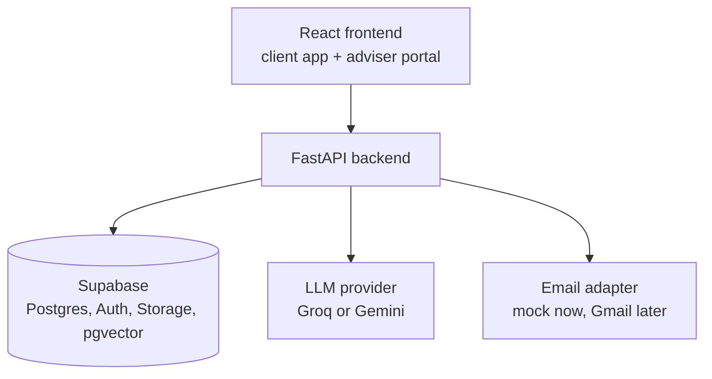

# Royal Square Platform

**A two-sided client and adviser platform for Royal Square Financial. Faster claims, clearer goals, automated reminders, and a document assistant that cites its sources.**

> Built for **AfriHack 2026** (Cape Town). Status: **in development, hackathon prototype**. The **backend is built and tested** (all 68 endpoints in the API contract, 367 automated tests, Supabase schema, seed data, document assistant). The frontend is not part of this work. All data in this repository is synthetic. Nothing here connects to Royal Square's production systems.

## Documentation

| Document | What it is |
|---|---|
| [docs/Royal_Square_Financial_PRD.pdf](docs/Royal_Square_Financial_PRD.pdf) | The client's requirements (source of truth) |
| [docs/PRD.md](docs/PRD.md) | Markdown copy of the PDF plus team notes |
| [docs/api.md](docs/api.md) | **API contract** (implemented). Share with the frontend team |
| [docs/ARCHITECT.md](docs/ARCHITECT.md) | Backend architecture, decisions, and what is and is not verified |
| [docs/Quickstart.md](docs/Quickstart.md) | Backend setup, run, test and deploy |
| [docs/TECHSTACK.md](docs/TECHSTACK.md) | Stack choices and their verification status |
| [docs/DESIGN.md](docs/DESIGN.md) | Screens, flows and product design principles |
| [AGENTS.md](AGENTS.md) | Roles, AI agents and working rules |

---

## The problem

Royal Square Financial is an independent brokerage and Financial Services Provider (FSP 29370) offering insurance and goal-based investments from major South African providers. Every client interaction generates admin: identity checks, record keeping, policy documents, renewals and claims. Advisers now spend more time on forms and searching documents than advising clients.

## What this platform does

One backend, two interfaces.

| For clients (mobile-friendly app) | For advisers (portal) |
|---|---|
| See policies, net worth, goals, open claims and reminders in one place | Manage assigned clients, the claims pipeline, goals and reminders |
| Report an accident and get an instant scene checklist | Update claim status and arrange logistics (hire car, repairs) |
| Register a motor claim with photos, licence and sketch | Ask questions of the firm's approved documents and get cited answers |
| Submit requests (address change, policy document, IRP5, consultation) | Surface and draft email replies linked to a claim (mock in the prototype) |

### Feature status

- [ ] Auth with client and advisor roles
- [ ] Client dashboard (policies, net worth, goals, claims, reminders)
- [ ] Goal tracking with progress bars
- [ ] Rule-based reminders
- [ ] Motor claims journey (accident checklist, claim registration, status timeline)
- [ ] Adviser claims pipeline
- [ ] RAG document assistant with document and page citations
- [ ] Client requests
- [ ] Email assistant (mock adapter; live Gmail is a post-hackathon goal)

## Demo story

1. A client taps **Report an Accident** and gets the scene checklist.
2. They register the claim with photos and documents.
3. The claim appears in the adviser's pipeline; the adviser updates its status and the client sees it.
4. The adviser asks the assistant a policy question and gets an answer with a document name and page number.
5. The adviser drafts the insurer email, linked to the claim.

## Architecture



Key decisions:

- All data access goes through the API. Roles come from a server-side profile, never from client-editable fields.
- Row-level security is enabled on all tables (default deny) as defence in depth.
- Retrieval runs inside Supabase Postgres, so no state lives on the API server's disk. It starts with full-text search; pgvector is added once an embedding model is chosen and verified (see [docs/ARCHITECT.md](docs/ARCHITECT.md) §8).
- The LLM sits behind a provider adapter so the model or vendor can change without touching business logic.
- Emails and documents are treated as untrusted input. The assistant drafts; a human sends.
- Reminders are computed on read (plus a manual "run check" endpoint), not by an in-process scheduler.

## Tech stack

| Layer | Technology |
|---|---|
| Frontend | React, TypeScript, Vite, Tailwind CSS, React Router, TanStack Query, React Hook Form |
| Backend | Python, FastAPI, Pydantic |
| Database, auth, storage | Supabase (PostgreSQL, Auth, Storage, pgvector) |
| LLM | Groq (primary), Gemini (fallback) |
| Hosting | Vercel (frontend), Render (backend) |

## Repository structure

```
<repo root>/
├── frontend/          # React app (client app + adviser portal, role-based routes)
├── backend/           # FastAPI service (routers, services, RAG, LLM and email adapters)
├── supabase/          # migrations: schema, RLS policies, indexes
├── data/rag-docs/     # approved documents for retrieval (4 synthetic PDFs, clearly labelled)
├── docs/              # PRD, API contract, architecture, quickstart, design, tech stack
├── scripts/           # warm_backend.sh (wake the hosted backend before a demo)
├── AGENTS.md
├── CLAUDE.md
└── README.md
```

Inside `backend/` the layout is described in [docs/ARCHITECT.md](docs/ARCHITECT.md) §3.

## Getting started

The full backend procedure, with a note on what has and has not been verified, is in [docs/Quickstart.md](docs/Quickstart.md). Summary, in order:

### Prerequisites

- Node.js (current LTS) and npm (frontend only)
- Python 3.10 or newer (verified: 3.10.12 on the development machine)
- A Supabase project
- An API key for Groq and/or Gemini

### Backend

1. **Create and activate the virtual environment first**, before installing anything:
   ```bash
   cd backend
   python3 -m venv .venv
   source .venv/bin/activate        # Windows: .venv\Scripts\activate
   ```
2. Create the environment file: `cp .env.example .env`, then fill it in. Never commit it.
3. `pip install -r requirements-dev.txt` (runtime and tests; production needs only `requirements.txt`)
4. Apply the migrations and load the demo data: `python scripts/migrate.py`, then `python scripts/seed.py --reset` (on Supabase add `--auth`)
5. Index the assistant's documents: `python scripts/ingest_docs.py`
6. `uvicorn app.main:app --reload`. Interactive API docs are served at `/docs`.
7. `pytest` runs the whole suite in about a minute with no external services.

No Supabase project? [docs/Quickstart.md](docs/Quickstart.md) §4 runs everything locally on a bundled PostgreSQL.

### Frontend

Owned by the frontend team. Copy `frontend/.env.example` to `frontend/.env` (when it exists), then `npm install` and `npm run dev`. The frontend integrates through [docs/api.md](docs/api.md).

## Environment variables

**Backend (`backend/.env`)**

| Variable | Purpose |
|---|---|
| `SUPABASE_URL` | Supabase project URL |
| `SUPABASE_SERVICE_ROLE_KEY` | Server-side key. Never expose to the browser |
| `DATABASE_URL` | Postgres connection string from the Supabase project |
| `AUTH_MODE` / `STORAGE_BACKEND` | `supabase` (default) or `local_hs256` / `memory` for offline development |
| `LLM_PROVIDER` / `LLM_FALLBACK_PROVIDER` | `groq`, `gemini` or `none` (primary and fallback) |
| `GROQ_API_KEY` / `GEMINI_API_KEY` | Provider keys |
| `GROQ_MODEL` / `GEMINI_MODEL` | Model names, set from each provider's current documentation |
| `EMAIL_PROVIDER` | `mock` (default) or `gmail` (not built) |
| `ALLOWED_ORIGINS` | Comma-separated frontend origins for CORS |

The complete list (upload limits, signed URL lifetime, rate limit, bucket names) is in [docs/Quickstart.md](docs/Quickstart.md) §3.

Token verification uses `supabase-py`'s `get_claims` (see [docs/ARCHITECT.md](docs/ARCHITECT.md) §4.2). Whether your Supabase project issues asymmetric or HS256 tokens is a project setting to check when first connecting.

**Frontend (`frontend/.env`)**

| Variable | Purpose |
|---|---|
| `VITE_SUPABASE_URL` | Supabase project URL |
| `VITE_SUPABASE_ANON_KEY` | Public (anon or publishable) key |
| `VITE_API_URL` | Backend base URL |

## Deployment

- **Frontend:** Vercel, with the project root directory set to `frontend`.
- **Backend:** Render web service, with the root directory set to `backend`.
- **Database and storage:** Supabase.

Free hosting tiers can put the backend to sleep when idle, which delays the first request. Use `scripts/warm_backend.sh https://<backend-host>` before demos.

## Security and data notes

- Demo and synthetic data only. Do not load real client data.
- Secrets live in environment variables only. Never commit keys.
- Uploads are restricted by type and size.
- Authorization tests cover client-to-client and client-to-adviser access.
- A real pilot needs a data-protection review, a privacy policy and consent flows. `[TODO]`

## Roadmap

**Hackathon:** claims journey, dashboards, goals, reminders and the cited document assistant on seed data.

**After the hackathon:** live Gmail integration (OAuth consent and verification work), real reminder scheduling, insurer integrations, an admin role with document library management, paid hosting, and a pilot with advisers.

## Team

`[TODO: names and roles]`

## License and ownership

`[TODO: confirm with the team, the client and the event rules before choosing a license.]`

## Acknowledgements

Brief and requirements supplied by Royal Square Financial for AfriHack 2026.