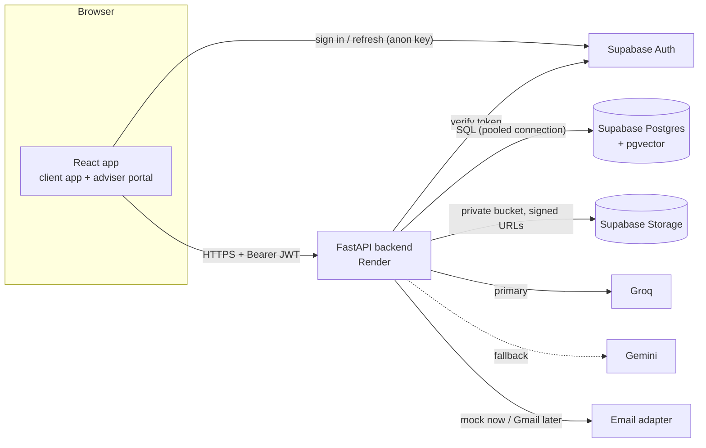
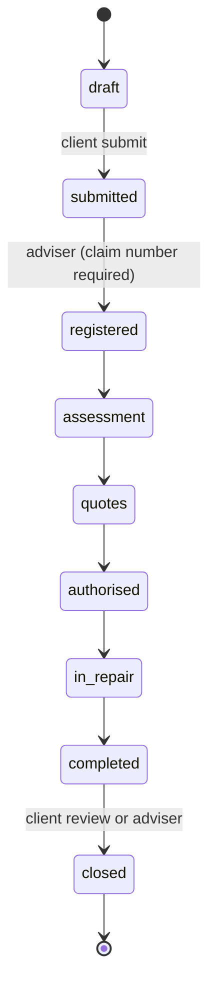
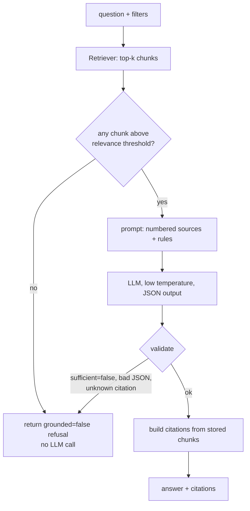

# Backend Architecture

| | |
|---|---|
| **Scope** | Backend only (FastAPI service, database, storage, RAG, email adapter). The frontend is owned by another team and integrates through [`api.md`](api.md). |
| **Status** | **Implemented** (backend v0.1.1, all 68 endpoints, 367 automated tests). Section 0 states exactly what has and has not been verified. Confidence labels used below: **Decided** (team or PRD decision), **Recommended** (the architect's proposal, reversible), **Open** (must be verified before it is relied on). |
| **Contract** | [`api.md`](api.md) is the source of truth for every route, shape and rule. This document explains *how* to build it. |
| **Requirements** | `Royal_Square_Financial_PRD.pdf` (mirrored in [`PRD.md`](PRD.md)). |
| **Judging context** | 5-minute live demo, 3-minute Q&A. The visible rubric weights functionality and stability (10), technical difficulty and elegance (10), innovation (10) and design/UX (20). Only page 1 of the rubric has been seen, so 50 of 100 points are unaccounted for. |

---

## 0. Implementation status: verified and not verified

| Area | Status | Evidence |
|---|---|---|
| All 68 endpoints, request validation, error envelope, role scoping | **Verified** | 367 automated tests against a real PostgreSQL 16 (bundled by the `pgserver` dev package) and the real migrations and seed. `test_contract.py` compares the running app with the endpoint index in `api.md`. |
| Cross-client and cross-adviser isolation, draft privacy, RLS on every table | **Verified** | `test_authorization.py`. Three deliberate code breakages (scoping, upload sniffing, draft privacy) were each caught by the tests. |
| Migrations, seed, document ingestion, `uvicorn app.main:app` | **Verified** | Run for real with the scripts in `backend/scripts/` and exercised over HTTP with `curl` (auth, uploads, dashboards, assistant refusal). |
| Retrieval quality on the demo corpus | **Verified on synthetic documents only** | A golden set of 9 answerable and 5 unanswerable questions. Real insurer wordings have not been tried. |
| Supabase: token verification, database, Storage, Auth users | **Verified live** (19 Sep 2026) | Real project: six demo users sign in through Supabase Auth and their ES256 tokens are accepted (`get_claims`, checked locally against the project's JWKS); Postgres 17 connection through the session pooler; migrations, seed and 4 indexed documents present; uploads reach a private bucket and read back byte-for-byte via signed URLs; tampered tokens, wrong roles and cross-client access are refused; CORS allows the frontend origin (5173) and refuses others. |
| Supabase Postgres connection (direct vs pooled host, IPv6) | **Not verified** | No Supabase project was available. Prepared statements are already disabled for pooler compatibility. |
| Gemini request/response format | **Verified live** (19 Sep 2026) | Real key, model `gemini-3.6-flash` (present in the key's model list): JSON-mode calls returned valid answers; assistant answers had correct page citations, follow-ups worked, email drafts were produced. Observed: occasional `503 high demand` (now retried once) and `429` after about 5 quick calls (quota not confirmed). |
| Groq request/response format | **Not verified** | No Groq key available (the value supplied was an xAI key). Tested only against mocked HTTP. Model names are configuration, never hardcoded. |
| Render deployment | **Not verified** | The start command works locally. |
| Frontend integration | **Partly verified** | All 40 API calls found in the frontend source map to real backend endpoints and supported query parameters. The frontend itself could not be built or run: see the report for the three blockers (untracked `src/lib`, Vite/plugin peer conflict, Node version). |
| Vector search / embeddings | **Not built** (Open, section 8.4) | Full-text search is used. |

**Known limitations** (deliberate for hackathon scale):

- A request holds one pooled database connection for its whole duration, including the LLM call (up to `LLM_TIMEOUT_SECONDS` per provider attempt). With the default pool of 8, several simultaneous assistant calls could starve other requests. Fix when scaling: release the connection before the model call and re-acquire to persist.
- The rate limiter and the token cache are in-process (single instance only).
- Email threads are filtered and paged in Python after loading the adviser's whole mailbox. Fine for a demo mailbox; move to SQL for real volumes.
- Response bodies are dicts, not Pydantic response models, so OpenAPI documents the requests but not the responses.

---

## 1. Design principles

1. **A small system that works beats a large system that impresses.** One FastAPI service, one Postgres database, one storage bucket, one LLM adapter.
2. **The API is the only door.** The browser never reads tables or storage directly. Roles come from a server-side profile, not from anything the user can edit.
3. **Every authorization decision lives in one place** (Section 4), not in individual routes.
4. **The LLM has narrow, checkable jobs**, and its output is validated by deterministic code before a user sees it (Section 8).
5. **Nothing simulated pretends to be real.** The email adapter is a mock and says so (`is_simulated`). Demo documents are labelled (`is_synthetic`).
6. **Reliability for the demo is a feature.** Seed data, a warm-up script, a fallback LLM provider, and a recorded fallback demo are part of the plan.

---

## 2. System context



| Component | Responsibility | Talks to |
|---|---|---|
| React frontend | UI. Uses Supabase only for sign-in. | Supabase Auth, backend |
| FastAPI backend | All business logic, authorization, RAG, email adapter. | Supabase (DB, Storage, Auth), LLM providers |
| Supabase Postgres | System of record. Full-text search and (later) vectors. | Backend only |
| Supabase Storage | Claim/request attachments and the RAG source PDFs. Private buckets. | Backend only |
| LLM providers | Text generation behind an adapter. | Backend only |
| Email adapter | `MockEmailProvider` now; `GmailProvider` is a post-hackathon goal. | Backend only |

There is no message queue, cache server, scheduler, or worker in v1. Each would add a failure point during a 5-minute live demo for no visible benefit.

---

## 3. Backend layout (as built)

```
backend/
├── app/
│   ├── main.py                 # create_app(); `uvicorn app.main:app` builds it lazily
│   ├── seed.py                 # synthetic demo data (used by scripts/seed.py AND the tests)
│   ├── core/                   # config, db (pool), auth (verifiers, Principal, scoping), errors, http (JSON/paging),
│   │                           #   rate_limit, logging, clock, migrate
│   ├── api/
│   │   ├── deps.py             # settings/storage/llm/retriever dependencies (read from app.state)
│   │   └── v1/                 # core_routes.py, claims_routes.py, advisor_routes.py (thin: validate, call a service)
│   ├── schemas/models.py       # every request body (Pydantic, extra=forbid)
│   ├── domain/constants.py     # statuses, labels, checklist, reminder types, request field definitions
│   ├── services/               # business rules AND their SQL: clients, catalog, finance, goals, reminders, claims,
│   │                           #   attachments, requests, dashboards, documents, assistant
│   ├── rag/                    # chunking, ingest, retrieval (FtsRetriever)
│   ├── llm/                    # base (router), providers (Groq, Gemini over httpx)
│   ├── email/                  # service (mock provider, flags, links), drafting
│   └── storage/                # base (Supabase + memory), sniff (content signatures)
├── scripts/                    # migrate.py, seed.py, ingest_docs.py, make_token.py, dev_db.py
├── tests/                      # 367 tests
├── requirements.txt            # pinned runtime versions
├── requirements-dev.txt        # + pytest, pgserver, fpdf2
└── .env.example
supabase/migrations/            # 0001_schema.sql, 0002_reference_data.sql
data/rag-docs/                  # 4 synthetic PDFs, manifest.json, generate_demo_docs.py
scripts/warm_backend.sh         # pings /health before a demo
```

The separate `repositories/` layer in the original plan was dropped: with hand-written SQL and small services, a second layer added indirection without benefit. SQL stays inside the service that owns it, always parameterised; the only dynamic SQL fragments (column names, `ORDER BY`) come from code allow-lists, never from user input.

Layer rule: **routes** validate input and call **services**; services hold the rules and the SQL. Routes never contain SQL.

---

## 4. Authentication and authorization

### 4.1 Flow (Decided)

1. The frontend signs in through Supabase Auth and receives an access token (JWT).
2. It sends `Authorization: Bearer <token>` to the backend.
3. A FastAPI dependency turns the token into a `Principal(id, role)`:
   - verify the token (4.2),
   - load the role from `profiles` (never from token metadata),
   - reject with `401`/`403` per `api.md` §1.4.

### 4.2 Token verification (Decided, verified in the installed library)

`SupabaseTokenVerifier` calls `supabase-py`'s `auth.get_claims(token)`. Reading the installed library source (supabase-auth 2.31) shows what it does: for tokens signed with an **asymmetric** key it verifies the signature locally against the project's JWKS; for **HS256** tokens it falls back to asking Supabase Auth (`get_user`). So one call handles both project configurations. A 60-second in-memory cache (keyed by a hash of the token, never outliving the token's own expiry) avoids a network round trip per request. Expired tokens are rejected locally as `token_expired` without any network call.

`AUTH_MODE=local_hs256` verifies HS256 tokens with `SUPABASE_JWT_SECRET` instead. It exists for offline development and is what the tests use. It must not be used in production unless the project really signs with a shared secret.

Whether a particular Supabase project issues asymmetric or HS256 tokens is a project setting that has **not** been checked here.

### 4.3 Scoping — one rule, one place (Decided)

```
Principal.role == client   →  allowed_client_ids = [principal.id]
Principal.role == advisor  →  allowed_client_ids = SELECT id FROM clients WHERE adviser_id = principal.id
```

- Every repository function that reads or writes client-owned data takes `allowed_client_ids` and puts it in the SQL `WHERE` clause. There is no "load then check" pattern that can be forgotten.
- Loading a single resource uses the same filter, so an out-of-scope id returns *not found* (`404`) instead of *forbidden*, matching `api.md` §2.3.
- Role-only checks (`require_role("advisor")`) are a separate dependency and return `403`.
- Draft claims are excluded from every adviser query at the repository level.

### 4.4 Row-level security (Decided, defence in depth)

The Supabase URL and **anon key are public** (they ship in the frontend). Anyone can therefore attempt to query Postgres over PostgREST with the anon key. The control that stops this is:

- RLS **enabled on every table with no permissive policies** (default deny), and
- **private** storage buckets with no policies.

The backend connects with a privileged connection that bypasses RLS, so RLS does not implement the business rules; the scoping in 4.3 does. Both layers are needed and both are tested (Section 12).

### 4.5 Secrets

Service-role key, database URL and LLM keys exist only in backend environment variables. They are never returned by any endpoint, never logged, and never in the frontend bundle.

---

## 5. Data model

Tables use `text` columns with `CHECK` constraints for enums (easier to migrate than Postgres enum types). Every table has `id uuid primary key default gen_random_uuid()` unless noted, plus `created_at`/`updated_at` where they make sense. Amounts are `bigint` cents.

| Table | Key columns | Notes |
|---|---|---|
| `profiles` | `id` (= `auth.users.id`), `role` (`client`\|`advisor`), `full_name`, `email`, `phone` | The only source of roles. |
| `clients` | `id` (= `profiles.id`), `adviser_id` → `profiles`, `date_of_birth`, `drivers_licence_expiry`, `client_since`, `last_annual_review_date` | In v1 every client has a login. |
| `insurers` | `name` (unique), `email_domains text[]` | Seeded from PRD §1 plus "Other" (migration 0002). `email_domains` is only used to recognise insurer senders in the simulated mailbox; the demo seed fills it with synthetic domains. |
| `policies` | `client_id`, `insurer_id`, `category`, `product_name`, `policy_number`, `status`, `asset_description`, `cover_amount_cents`, `current_value_cents`, `premium_cents`, `premium_frequency`, `start_date`, `renewal_date`, `valuation_certificate_date` | |
| `financial_items` | `client_id`, `kind`, `category`, `label`, `amount_cents`, `as_of_date` | Balance sheet lines. |
| `goals` / `goal_participants` | goal: `title`, `category`, `status`, `target_amount_cents`, `current_amount_cents`, `target_date`, `created_by`; participants: `(goal_id, client_id)` | Shared goal = more than one participant. |
| `reminders` | `client_id`, `type`, `title`, `due_date`, `audience`, `status`, `source`, `related_resource`, `related_id`, `dedupe_key` **unique**, `completed_at` | `dedupe_key` makes computed-on-read generation idempotent (Section 6). |
| `claims` | `client_id`, `policy_id`, `insurer_id`, `reference` (unique, null while draft), `status`, `status_changed_at`, incident columns, police columns, driver columns, `vehicle_use`, `witnesses jsonb`, `third_parties jsonb`, insurer detail columns, repair columns, hire car columns, review columns, `submitted_at`, `closed_at` | Nested API objects map to flat columns; witnesses and third parties are JSONB arrays because the API replaces them whole. |
| `claim_events` | `claim_id`, `type`, `title`, `message`, `visible_to_client`, `from_status`, `to_status`, `actor_id` | The timeline, and the audit trail. Append-only. |
| `requests` | `client_id`, `type`, `status`, `payload jsonb`, `client_note`, `adviser_response`, `handled_by`, `completed_at` | Payload validated per type in the service layer. |
| `attachments` | `claim_id` **or** `request_id` (exactly one, enforced by `CHECK`), `kind`, `label`, `storage_path`, `filename`, `content_type`, `size_bytes`, `uploaded_by` | Two nullable foreign keys instead of a polymorphic id, so the database enforces integrity. |
| `documents` | `title`, `category`, `insurer_id`, `page_count`, `version_label`, `is_synthetic`, `source_note`, `storage_path`, `status`, `content_hash`, `indexed_at` | RAG library. |
| `document_chunks` | `document_id`, `page`, `chunk_index`, `content`, `tsv tsvector` (generated), optional `embedding vector(N)` | One chunk never spans two pages, so a page citation is exact. |
| `assistant_conversations` / `assistant_messages` | conversation: `advisor_id`, `title`; message: `role`, `content`, `grounded`, `citations jsonb` | |
| `email_threads` / `email_messages` | thread: `advisor_id` (whose mailbox), `subject`, `unread`, `manual_client_id`, `manual_claim_id`; message: `from_*`, `to_recipients`/`cc_recipients` (jsonb), `sent_at`, `body_text` | Snippets, flags, importance and automatic links are computed on read; only a manual link is stored. |
| `schema_migrations` | `filename`, `applied_at` | Written by `app/core/migrate.py` (used by `scripts/migrate.py`). |

Other details:

- **Claim reference:** a database sequence formatted `CLM-<year>-<zero-padded number>`, assigned at submit.
- **Money:** never `float`.
- **Indexes:** at minimum on `claims(client_id, status)`, `reminders(client_id, status, due_date)`, `requests(client_id, status)`, `claim_events(claim_id, created_at)`, `document_chunks(document_id, page)` and a GIN index on `document_chunks.tsv`.
- **Personal data minimisation:** no national ID number column exists. ID documents and licences are stored as attachments, not typed fields. Bank account numbers appear only inside a request payload and are masked for clients on read (`api.md` §5.11).

---

## 6. Reminder engine (computed on read)

There is no scheduler (Decided, README). Instead:

1. `reminders_engine.evaluate(client_ids)` runs at the start of `GET /reminders`, the dashboards, and `POST /reminders/run-check`.
2. For each client in scope it builds the candidate reminders from the rules in `api.md` §3.2 (licence expiry, valuation certificate, annual review, retirement fee renewal, birthday, anniversary, police report deadline).
3. A candidate is inserted only if `due_date − today ≤ lead_days` and `dedupe_key` does not exist.
4. `dedupe_key = "<type>:<client_id>:<related_id or ->:<due_date>"`, with a unique index and `INSERT … ON CONFLICT DO NOTHING`, so concurrent requests cannot create duplicates.
5. Because `due_date` is part of the key, the next cycle (for example the next birthday) creates a new reminder after the old one is done.

Cost is small: a handful of clients and one set-based query per rule. If the client count grows, move evaluation to a scheduled job; the engine function stays the same.

---

## 7. Claims

### 7.1 State machine (Decided, from PRD §4.4 C)



- Transitions are defined in one table in `services/claims.py` (`from → to`, allowed actor, preconditions). The route, the `allowed_transitions` response field and the validation all read from that one table.
- One step back is allowed for advisers (except into/out of `draft`, and out of `closed`).
- Every transition and every field update appends a `claim_events` row in the same database transaction as the change.

### 7.2 Attachments

- Stored in a **private** Storage bucket at `claims/<claim_id>/<attachment_id>-<sanitized filename>`; the row in `attachments` holds the path.
- Validation order: size (stream with a limit, do not buffer unbounded), then **content signature** (magic bytes for JPEG, PNG, WebP, PDF, and the supported audio containers), then check the signature against the declared type and the allowed types for the `kind`. Reject with `413`/`415`. Filenames are sanitised and never used as paths.
- The API returns short-lived signed URLs generated at read time. They are never stored.

### 7.3 Submit validation

`missing_fields` is computed by one function used by both `GET`/`PATCH` (to report progress) and `POST /submit` (to enforce), so the two can never disagree.

---

## 8. RAG document assistant

### 8.1 What the model does, and does not do

| Question | Answer |
|---|---|
| What does the LLM do? | Reads a question plus up to *k* retrieved passages and writes a short answer that cites passages by number. |
| What does deterministic code do? | Retrieval, refusing when nothing relevant is found, mapping `[n]` markers to real document/page/quote, validating the output. |
| Why not deterministic only? | Advisers ask natural-language questions across long wordings; a search result list is the fallback, not the product. |
| Why not just ChatGPT? | It cannot restrict itself to the firm's approved documents, and it cannot produce verifiable document-and-page citations. |
| What if the model is wrong? | Citations are built from stored chunks, not from model text, so the adviser can open the exact page and check. |

### 8.2 Ingestion (`scripts/ingest_docs.py`, run offline)

1. Read `data/rag-docs/manifest.json` (title, category, insurer, `is_synthetic`, `source_note`).
2. Extract text **per page** (a pure-Python PDF library such as `pypdf`; verify the installed API in the venv). Pages with no extractable text (scans) are logged and skipped; OCR is out of scope.
3. Chunk within a page (roughly 800 to 1000 characters with small overlap); a chunk never crosses a page boundary.
4. Upsert `documents` and `document_chunks`, keyed by `content_hash`, so re-running is idempotent. Upload the PDF to a private bucket.
5. If vectors are enabled (8.4), embed in batches.

**Demo corpus (Decided in the README):** synthetic documents labelled `is_synthetic = true` (a demo motor policy wording, an internal claims process, an internal hire-car process, a company policy). Public legislation may be added by the team after they confirm the source and licence; I have not verified any specific document or URL. Real insurer wordings must not be assumed to be freely redistributable.

### 8.3 Retrieval — interface first

Define `Retriever.search(question, filters, k) -> list[Chunk]` and build behind it.

**Default (built): Postgres full-text search.** No external dependency, no embedding cost, deterministic, and works offline in the demo. The question's keywords (stopwords removed) form an *OR* query (an *AND* query returns nothing whenever one word of a natural-language question is absent from the text). Passages are ranked by the **IDF-weighted number of keywords matched**, so a rare term such as "notification" outweighs a term such as "claim" that appears on every page; `ts_rank_cd` breaks ties. A relevance floor (at least half the keywords must match) makes off-topic questions return nothing, in which case the model is never called. This was added after the golden-question tests showed unweighted ranking putting the wrong page first.

Known weakness, stated honestly: stemming does not connect all paraphrases (for example a question that says "notify" against a wording that says "notification" may stem differently). Mitigation: a golden question set (Section 12) that is run against the demo corpus, and the vector option below.

### 8.4 Embeddings — **Open**

| Option | Notes |
|---|---|
| None (FTS only) | Ship this first. |
| Hosted embeddings (for example via the Gemini API key already in use) | **Requires verification** of current model names, output dimension, limits and pricing from the provider's docs. I have not verified these. |
| Local embedding model | **Requires verification** that it fits Render's memory and build limits and does not slow cold starts. |

**Rule:** do not create the `embedding vector(N)` column until the model, and therefore `N`, is chosen. When it is, add hybrid retrieval (FTS results and vector results merged by reciprocal rank fusion). The README states "pgvector"; that remains the plan for the vector store once the embedding model is verified.

### 8.5 Grounding pipeline



Rules enforced in code (they back the guarantees in `api.md` §5.13):

1. The prompt contains only the retrieved chunks, each as `[n] title, page p: text`, with an instruction to answer only from them, cite as `[n]`, and say when the sources are insufficient.
2. The model returns JSON `{answer, used_sources, sufficient}`, validated with Pydantic. Invalid JSON gets one retry, then the refusal.
3. Markers in `answer` must be a subset of the sources provided. Unknown markers, or `sufficient = false`, produce the refusal.
4. `quote`, `document_title` and `page` come from the database rows, never from model output.
5. Document text is untrusted: it is wrapped in delimiters and the system prompt states that instructions inside sources must be ignored. This reduces, but does not eliminate, prompt-injection risk. The controls that matter are that the assistant has no tools and cannot take actions, and that its output is validated.
6. Follow-up questions: retrieval uses the current question plus the previous user question when the current one is very short; the LLM also receives the last few turns. No separate rewrite call (saves latency and a failure point).

### 8.6 LLM adapter

```python
class LLMProvider(Protocol):
    def generate(self, messages: list[Message], *, json_mode: bool, timeout_s: float) -> LLMResult: ...
```

- Implementations: Groq (primary) and Gemini (fallback), selected by `LLM_PROVIDER` and `LLM_FALLBACK_PROVIDER`.
- Model names come from `GROQ_MODEL` / `GEMINI_MODEL`. **They are never hardcoded**; model availability and free-tier limits change, and I have not verified current values. Pick them at build time from the providers' documentation and record them in `.env.example`.
- Timeout (for example 20 seconds), one retry on a transient failure, then the fallback provider, then `503 llm_unavailable` with `retry_after_seconds`. Provider `429`s are surfaced as `429 rate_limited` / `503` with the retry hint.
- Evaluate whether the chosen SDKs or plain `httpx` calls are simpler; both providers must be checked against their current documentation first. LangChain and LlamaIndex are **not** used (see Section 15, D-2).

### 8.7 Cost and rate control

A single in-process sliding-window limiter per user (10 per minute, configurable) protects the free-tier quota. It is per process, which is fine for one Render instance and must be replaced by a shared store if the service is scaled out.

---

## 9. Email adapter and drafting

```python
class EmailProvider(Protocol):
    def status(self) -> EmailStatus: ...
    def list_threads(self, scope, filters, page) -> Page[EmailThread]: ...
    def get_thread(self, scope, thread_id) -> ThreadWithMessages: ...
```

- **`MockEmailProvider` (hackathon):** reads seeded `email_threads` / `email_messages`. Every returned object has `is_simulated = true`.
- **`GmailProvider` (post-hackathon):** Google OAuth 2.0 and the Gmail API. Needs a Google Cloud project, a consent screen and, for a real deployment, an OAuth verification process, plus encrypted refresh-token storage. **Not built; not verified here.** The `/email/oauth/*` routes return `501`.
- **Flags and auto-links** are deterministic rules in `email/rules.py` (sender matches a known insurer/client, the text contains a known claim number/reference, deadline keywords). They run when threads are read, need no LLM, and are unit-tested.
- **Draft generation:** the service builds a facts block from the database (client name, incident date and place, police case number, insurer, claim number if present). The LLM writes prose around those facts. After generation, code checks that any claim-number-like or case-number-like token in the draft exists in the facts block; unknown ones are removed and reported in `warnings`. Missing facts are reported, never invented. There is no send function anywhere in the codebase.
- Email bodies are untrusted input (Section 8.5, rule 5 applies).

---

## 10. Storage layout

| Bucket | Content | Access |
|---|---|---|
| `attachments` (private) | `claims/<claim_id>/…`, `requests/<request_id>/…` | Backend only; signed URLs to users |
| `rag-docs` (private) | `<document_id>.pdf` | Backend only; signed URLs to advisers |

Signed URL lifetime is `SIGNED_URL_TTL_SECONDS` (default 600).

---

## 11. Cross-cutting concerns

| Concern | Approach |
|---|---|
| Errors | One exception type (`ApiError`) and handlers that produce the `api.md` §1.4 envelope for HTTP errors, validation errors (including FastAPI's own 422) and uncaught exceptions. |
| Request IDs | Middleware sets `X-Request-ID` (accepting a valid client-supplied one) and adds it to every log line and error body. |
| Logging | Structured (JSON) logs to stdout. Log method, route, status, latency, request id, user id. **Never log bodies, tokens, bank details, email bodies or document text.** |
| Config | `pydantic-settings`; the app refuses to start if a required variable is missing, naming the variable. |
| CORS | Origins from `ALLOWED_ORIGINS`; exact match. |
| Transactions | A state change and its `claim_events` row commit together. |
| Concurrency | Connection pool (psycopg). Handlers are synchronous `def`, which FastAPI runs in a thread pool; simple and adequate for demo load. |
| Python version | Target **3.10+** (the development machine has 3.10.12; the README's earlier "3.11+" was corrected). Avoid 3.11-only features (`tomllib`, `enum.StrEnum`, `typing.Self`, `ExceptionGroup`). |
| Personal information | The data is synthetic. A real pilot handles personal information of South African data subjects, so a data-protection review is required first (the README already notes this). Which specific legal obligations apply is a question for a qualified adviser; it is not asserted here. |

---

## 12. Testing strategy

Priority is tests that would embarrass the team in the demo or in Q&A.

| Area | Tests |
|---|---|
| **Authorization** (must-have) | Client A cannot read, list or modify Client B's claim, policy, goal, reminder or request (`404`). A client gets `403` on adviser-only routes. Adviser X cannot see adviser Y's clients. Advisers never see draft claims. Anonymous access is `401`. |
| Claim state machine | Every allowed transition, every rejected transition, the claim-number precondition, `allowed_transitions` matches enforcement. |
| Submit validation | Each missing field appears in `details`; a complete draft submits. |
| Attachments | Wrong signature with a right `Content-Type` is rejected; oversize is `413`; count limit is enforced. |
| Reminders | Rule inside/outside the lead window; running the evaluation twice creates no duplicates; date change creates the right reminder. |
| RAG guarantees | Golden question set on the demo corpus (about 10 answerable, about 3 unanswerable): answerable ones return `grounded = true` with a correct page; unanswerable ones refuse. Unit tests for citation validation using a **fake LLM** that returns bad JSON, unknown markers and injection text. |
| Email | Flag and auto-link rules; draft post-check strips invented claim numbers (fake LLM). |
| Contract | The generated OpenAPI is compared with `api.md` endpoints (a checklist test on method and path) so drift is caught. |

External services (Supabase Auth, LLM providers) are replaced by fakes in unit tests. A single manual smoke test against the real services is part of the pre-demo checklist.

---

## 13. Deployment

| Item | Value |
|---|---|
| Host | Render web service, root directory `backend` (Decided) |
| Build | `pip install -r requirements.txt` |
| Start | `uvicorn app.main:app --host 0.0.0.0 --port $PORT` (Render supplies `PORT`; **requires confirmation** against Render's current docs) |
| Health check | `GET /health` (does not touch the database) |
| Migrations | `python scripts/migrate.py`, run manually against Supabase before deploy; not run automatically at boot |
| Cold starts | Free tiers can sleep; `scripts/warm_backend.sh` pings `/health` before the demo, and the frontend uses a long first-request timeout |
| Database connection | Use the connection string Supabase provides for external hosts. Whether the direct host is reachable from the deployment target (it may be IPv6 only) or the pooled host is required **must be confirmed in the Supabase project settings**. |
| Secrets | Render environment variables only |

Environment variables are listed in [`Quickstart.md`](Quickstart.md).

---

## 14. Build order (completed)

All phases below were built in this order; each left a working system. Kept as the record of how the pieces depend on each other.

| Phase | Deliverable | Endpoints (api.md) |
|---|---|---|
| 0. Scaffold | venv **created and activated first**, `.env`, config, app factory, error envelope, request ids, `/health`, CORS | 1 |
| 1. Data and identity | migrations + `migrate.py`, RLS default deny, seed script, token verification, `GET /me`, scoping helpers, authorization test harness | 3, 4 |
| 2. Read model | meta, insurers, policies, clients, goals, net worth, reminders + engine, both dashboards | 2, 5–13, 16–18, 21–24, 26–29, 31 |
| 3. Claims | checklist, draft/patch/attachments/submit, adviser pipeline, insurer details, transitions, updates, then hire car, repair, review | 32–47 |
| 4. Requests | types, submit, list, action | 48–53 |
| 5. Assistant | corpus, ingestion, retrieval, grounding pipeline, `/documents`, `/assistant/query` | 54–57 |
| 6. Email | mock provider, seed threads, rules, drafting | 61–66 |
| 7. Hardening | full authorization tests, golden RAG set, demo seed rehearsal, warm-up script, recorded fallback demo | — |

Numbers refer to the endpoint index in `api.md` §9. P2 endpoints are last and may stay as `501`.

---

## 15. Decision log

| ID | Decision | Status | Reason |
|---|---|---|---|
| D-1 | FastAPI + Pydantic, Supabase (Postgres, Auth, Storage), React, Vercel, Render, Groq with Gemini fallback | Decided (team) | From `TECHSTACK.md`. |
| D-2 | No LangChain or LlamaIndex. RAG is about a few hundred lines behind a `Retriever` and an `LLMProvider` | Recommended | One retrieval path and one prompt do not justify a large dependency; fewer moving parts and easier to explain in Q&A. Reversible. |
| D-3 | Retrieval: Postgres full-text search first; vectors (pgvector) added once an embedding model is verified. Chroma not used | Recommended | pgvector was the team's stated vector store; the embedding model is unverified, and FTS is dependable for a demo. |
| D-4 | Data access with `psycopg` 3 and hand-written SQL in repositories, not an ORM and not the PostgREST client | Recommended | Dashboards, pipeline grouping and text search are set-based SQL; no ORM ceremony. Verify the installed version in the venv. |
| D-5 | `supabase` Python client used only for Auth and Storage | Recommended | Small surface; verify its API in the venv. |
| D-6 | Token verification via `auth.get_claims`, with a short cache (Section 4.2) | Decided | Verified in the installed library source that it handles both asymmetric and HS256 tokens. Not yet run against a live project. |
| D-7 | Reminders computed on read, no scheduler | Decided (README) | No background process to fail during the demo. |
| D-8 | `client.id` equals the auth user id | Recommended | Avoids a second identity for the hackathon. |
| D-9 | Email is a mock adapter labelled simulated | Decided (PRD §5.2) | Live Gmail OAuth is out of hackathon scope. |
| D-10 | Python 3.10+ | Decided (environment) | Only 3.10.12 is installed on the development machine. |
| D-11 | No `repositories/` layer; SQL lives in the owning service | Decided | Less indirection at this size. |
| D-12 | Tests run on a real PostgreSQL (`pgserver`), not on mocks | Decided | The riskiest code is SQL (scoping, full-text search, constraints); mocks would not test it. |

---

## 16. Risks and fallbacks

| Risk | Impact | Fallback |
|---|---|---|
| LLM provider rate limit or outage during the demo | Assistant and drafts fail | Fallback provider; friendly `503`; retrieval-only mode returns ranked passages with citations and no generated answer |
| Cold-start delay | First request slow | Warm-up script; long first timeout in the frontend |
| Supabase connectivity (pooler/IPv6, credentials) | Whole API fails | Verify connection settings on day one; keep a local Postgres option for development |
| Token verification misconfigured | Nobody can log in | Build and test `GET /me` first (Phase 1) before anything depends on it |
| FTS misses a paraphrased question | Wrong refusal in the demo | Golden question set; rehearse with known questions; add vectors if time permits |
| Scope creep | Unfinished P0 | Nothing is left as `501` except the two Gmail OAuth routes, which are deliberately reserved |
| Several simultaneous LLM calls exhaust the connection pool | Slow or failing requests during a busy demo | Per-user rate limit; keep the demo to a few concurrent users; see Known limitations for the proper fix |
| Unverified libraries or APIs | Time lost | Verify each dependency in the activated venv before designing around it; do not trust this document's library names as verified |

---

## 17. Explicitly not building

Kubernetes, microservices, message queues, background workers, GraphQL, WebSockets or Supabase Realtime, an admin UI, document upload over the API, live Gmail, real insurer integrations, outbound email/SMS/push, native mobile support beyond a responsive API, multi-tenancy.
