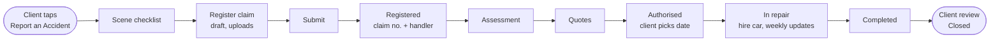

# Product Design: Flows, Screens and Principles

**Royal Square Financial — Client & Advisor Platform · AfriHack 2026**

This document defines *what each screen must do and which API calls power it*. It does **not** define visual design (colours, typography, components, layout, motion). That belongs to the frontend team; see Section 7.

Related documents: [`PRD.md`](PRD.md) (requirements), [`api.md`](api.md) (API contract), [`ARCHITECT.md`](ARCHITECT.md).

---

## 1. Principles

These come from the PRD and the team's project brief.

1. **Two audiences, two tones.** Client-facing language is simple and reassuring. Adviser-facing language is efficient. The API supplies role-appropriate status labels (`client_label` / `advisor_label`, `status_label`) so the two never drift.
2. **Claims are status-driven.** A claim's screen is built around one ordered status and a timeline, not around forms. The client always knows what has happened and what happens next.
3. **Less paperwork.** Never ask for something the system already has. Uploads beat typing (ID documents and licences are photos, not typed numbers).
4. **One source of truth.** Client and adviser see the same claim, goal and reminder records.
5. **Nothing simulated looks real.** The email area shows a "Demo email" indicator; demo documents show a "Demo document" indicator (`is_simulated`, `is_synthetic` in the API).
6. **Works on a phone at the roadside.** The client app is mobile-first. The accident checklist is static and cacheable so it can appear instantly on a poor connection.
7. **Assistant answers are checkable.** Every assistant answer shows numbered citations that open the source document at the cited page.

---

## 2. Roles and entry points

| Role | Lands on | API |
|---|---|---|
| Client | Client dashboard | `GET /me` then `GET /me/dashboard` |
| Advisor | Adviser dashboard | `GET /me` then `GET /advisor/dashboard` |

Routing is decided by `role` from `GET /me`, never by anything the user can edit.

---

## 3. Client app: screens

| Screen | Must show / do | Main API calls |
|---|---|---|
| Dashboard | Net worth, policies, open claims with status, goal progress bars and percentages, upcoming reminders, pending requests, the client's adviser | `GET /me/dashboard` |
| Policies | List and detail of the client's policies | `GET /policies`, `GET /policies/{id}` |
| Goals | Goals with progress bars and percentages (view only) | `GET /goals` |
| Reminders | Upcoming and overdue reminders; mark done | `GET /reminders`, `POST /reminders/{id}/complete` |
| Report an accident | The scene checklist, shown immediately, no dependency on the network beyond the first load | `GET /claims/checklist` |
| Register a claim | Multi-step form: insurer, incident, police, driver and use, witnesses, third parties, uploads (photos, licence, sketch), review, submit. Shows progress from `missing_fields`. | `GET /insurers`, `POST /claims`, `PATCH /claims/{id}`, `POST /claims/{id}/attachments`, `POST /claims/{id}/submit` |
| Claim tracking | Status stepper, timeline of updates, insurer claim number and handler, repair and hire-car details, choose repair date, leave a review at the end | `GET /claims/{id}`, `POST /claims/{id}/repair-date`, `POST /claims/{id}/review` |
| Requests | Choose a type, fill a form generated from field definitions, attach files, track status | `GET /requests/types`, `POST /requests`, `GET /requests`, `GET /requests/{id}` |
| Profile | Phone and licence expiry (feeds the licence reminder) | `GET /me`, `PATCH /me` |

## 4. Adviser portal: screens

| Screen | Must show / do | Main API calls |
|---|---|---|
| Dashboard | Counts, claims by status, a prioritised "needs attention" list, upcoming reminders | `GET /advisor/dashboard` |
| Clients | Searchable list of assigned clients | `GET /clients` |
| Client detail | The client's dashboard from the adviser's side; edit key dates; manage goals, financial items and reminders | `GET /clients/{id}/dashboard`, `PATCH /clients/{id}`, `POST /goals`, `PATCH /goals/{id}`, `POST /financial-items`, `POST /reminders` |
| Claims pipeline | Board grouped by status, oldest first, with days-in-status | `GET /claims/pipeline` |
| Claim detail | Full record and attachments, record insurer details, move status (buttons come from `allowed_transitions`), hire car and repair logistics, post updates (weekly repair update), linked email, draft insurer email | `GET /claims/{id}`, `PATCH /claims/{id}/insurer-details`, `POST /claims/{id}/transitions`, `PATCH /claims/{id}/hire-car`, `PATCH /claims/{id}/repair-details`, `POST /claims/{id}/updates`, `GET /email/threads?claim_id=`, `POST /email/drafts/generate` |
| Requests | Queue of client requests; action and respond | `GET /requests`, `PATCH /requests/{id}` |
| Reminders | All reminders across clients; create manual ones; force a check | `GET /reminders`, `POST /reminders`, `POST /reminders/run-check` |
| Document assistant | Ask a question, see an answer with numbered citations, open the document at the page, follow-up questions, filter by category | `POST /assistant/query`, `GET /documents`, `GET /documents/{id}/url` |
| Email | Flagged threads, thread view, link to client or claim, "Demo email" indicator | `GET /email/status`, `GET /email/threads`, `GET /email/threads/{id}`, `PUT /email/threads/{id}/link` |

---

## 5. The motor claim journey

| Status | Client sees | Adviser does |
|---|---|---|
| Draft | "Not sent yet" (only the client sees it) | — |
| Submitted | "Sent to Royal Square" | Records the insurer's claim number and handler, then moves to Registered |
| Registered | "Registered with your insurer" | Moves to Assessment when the vehicle goes for assessment |
| Assessment | "Vehicle assessment" | Moves to Quotes when the assessment has gone to the insurer |
| Quotes | "Repair quotes" | Records quote details; moves to Authorised when the insurer approves |
| Authorised | "Repairs approved", asked to pick a drop-off date | Records repairer and dates |
| In repair | "Being repaired", weekly updates | Arranges hire car and delivery; posts weekly updates |
| Completed | "Repairs finished", asked for a short review | Arranges collection and return of the hire car |
| Closed | "Closed" | — |

The exact labels are returned by `GET /meta` (`claim_statuses`).

---

## 6. States every screen should handle

| State | Guidance |
|---|---|
| Loading | Show a skeleton or spinner. The first request after idle can be slow on free hosting (allow about 60 seconds before giving up). |
| Empty | Say what belongs here and what to do next (for example "No open claims"). |
| Validation error (`422`) | Map `error.details[].field` to form fields. |
| Forbidden or missing (`403`/`404`) | A neutral "not found" page. |
| Rate limited or LLM unavailable (`429`/`503`) | "Try again in N seconds" from `retry_after_seconds`. |
| Session expired (`401 token_expired`) | Refresh silently once; otherwise send the user to sign in. |
| Untrusted text | Email bodies, descriptions and statements are rendered as plain text only. |

---

## 7. Not defined here (frontend team to decide)

- Visual identity: colours, typography, iconography, logo use (Royal Square branding has not been provided to the backend team)
- Component library, layout grid, motion
- Accessibility targets and testing approach
- Sketch tool for the accident diagram (the API accepts the exported image as an `accident_sketch` attachment)
- Copy beyond what the API supplies

When these are decided, record them in a new section of this file so backend and frontend stay aligned on labels and flows.
