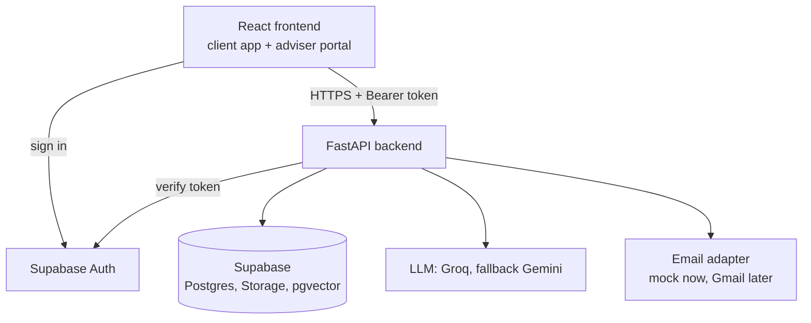

# Technology Stack

**Royal Square Financial — Client & Advisor Platform · AfriHack 2026 · Version 1.1**

Related documents: [`ARCHITECT.md`](ARCHITECT.md) (how the backend is built and why), [`api.md`](api.md) (API contract), [`Quickstart.md`](Quickstart.md) (setup).

**Status labels:** **Decided** = the team's choice. **Recommended** = the backend architect's proposal, reversible. **Open** = must be verified before it is used. Nothing here has been checked against live vendor documentation unless it says so; library and model names must be verified in the project's virtual environment or the vendor's docs before being relied on.

---

## 1. Stack overview

| Layer | Technology | Status | Purpose |
|---|---|---|---|
| Frontend | React | Decided | Client app and adviser portal (single codebase, role-based routes) |
| Backend | Python + FastAPI | Decided | REST API, business rules, RAG, integrations |
| Database | Supabase (PostgreSQL) | Decided | All structured data |
| File storage | Supabase Storage (private buckets) | Decided | Claim photos, documents, sketches, RAG source PDFs |
| Authentication | Supabase Auth | Decided | Sign-in for clients and advisers. Roles live in a server-side `profiles` table |
| Frontend hosting | Vercel | Decided | React app |
| Backend hosting | Render | Decided | FastAPI service |
| LLM | Groq (primary), Google Gemini (fallback) | Decided | RAG answers and email drafting |
| Vector store | Supabase pgvector | Decided, timing **Open** | Added once an embedding model is verified; full-text search first |
| Email | Mock adapter now; Gmail API + OAuth 2.0 later | Decided | Adviser email assistance (simulated in the hackathon build) |

Supported Python versions: **3.10 or newer** (the development machine has 3.10.12).

---

## 2. Frontend (owned by the frontend team)

Single codebase with role-based routing. Recommended libraries: React Router, Tailwind CSS, TanStack Query, React Hook Form, Lucide React or Heroicons, TypeScript with Vite.

- The frontend uses Supabase **only for sign-in** (with the public anon key). All data goes through the backend API; see [`api.md`](api.md).
- Deployment: Vercel, root directory `frontend`.

The backend team does not modify the frontend.

---

## 3. Backend (FastAPI)

Provides the REST API described in [`api.md`](api.md), automatic OpenAPI/Swagger docs, file uploads, the RAG endpoint, reminder evaluation, and the email adapter.

Expected Python packages (**Recommended**; verify each and pin the versions actually installed in the venv):

| Package | Use |
|---|---|
| `fastapi`, `uvicorn` | Web framework and server |
| `pydantic`, `pydantic-settings` | Request/response models, configuration |
| `psycopg` (v3, with pool) | PostgreSQL access with hand-written SQL |
| `supabase` | Auth verification and Storage only |
| `httpx` | HTTP client (LLM providers, if plain HTTP is simpler than an SDK) |
| `python-multipart` | File uploads |
| `pypdf` | Per-page PDF text extraction for RAG ingestion |
| `pytest` | Tests |

Provider SDKs (Groq, Gemini) are chosen after reading each provider's current documentation.

**Changes from the previous version of this file**

- "supabase or sqlalchemy + asyncpg" is resolved to `psycopg` with SQL in repositories (`ARCHITECT.md` D-4).
- "langchain or llama-index" is dropped: one retrieval path and one prompt do not need a framework (D-2).
- "pgvector or Chroma" is resolved to pgvector, in line with the README (D-3).

---

## 4. Database and storage (Supabase)

| Service | Usage |
|---|---|
| PostgreSQL | Clients, policies, goals, reminders, claims, claim events, requests, documents and chunks, assistant conversations, email mock data |
| Supabase Auth | Email/password or magic-link sign-in |
| Supabase Storage | Private buckets for attachments and RAG PDFs; access only through short-lived signed URLs issued by the backend |
| pgvector | Document embeddings, once the embedding model is chosen |

Row-level security is enabled on every table with **no permissive policies** (default deny), because the anon key is public. The backend connects with a privileged connection and enforces access rules itself ([`ARCHITECT.md`](ARCHITECT.md) §4).

---

## 5. LLM and RAG

The advisor-side assistant uses retrieval-augmented generation. Only approved documents are indexed, and every answer carries citations (document name and page number). Retrieval and validation are deterministic code; the model only writes the answer text from retrieved passages ([`ARCHITECT.md`](ARCHITECT.md) §8).

### LLM providers

| Provider | Role | Notes |
|---|---|---|
| Groq | Primary | Chosen by the team. |
| Google Gemini | Fallback | Chosen by the team. |
| Together.ai, OpenRouter | Candidates only | Not selected. |

**Not verified:** free-tier limits, pricing, current model names and availability, and rate limits for any provider. These change; read each provider's documentation at build time and set model names through environment variables (`GROQ_MODEL`, `GEMINI_MODEL`), never in code.

The earlier version of this file described Groq's free tier as "generous", named specific model families, and advised against a further provider. Those statements were not backed by a source in this repository and were removed.

### Embeddings

**Open.** No embedding provider or model has been chosen or verified. Retrieval starts with PostgreSQL full-text search and gains vector search when a model is verified. See [`ARCHITECT.md`](ARCHITECT.md) §8.4.

---

## 6. Email integration

| | |
|---|---|
| Focus | Gmail |
| Capabilities | Flag important emails, retrieve thread context, help draft replies, link emails to clients and claims |
| Hackathon build | Mock adapter with seeded, synthetic threads, labelled as simulated in the API and UI |
| Later | Google OAuth 2.0 and the Gmail API. Requires a Google Cloud project, an OAuth consent screen, secure token storage, and possibly Google's app verification for real use (not verified here) |
| Rule | The assistant drafts; a human sends. There is no send function |

---

## 7. Deployment summary

| Component | Platform |
|---|---|
| React frontend | Vercel |
| FastAPI backend | Render (root directory `backend`) |
| Database, storage, auth | Supabase (managed) |

All secrets (API keys, OAuth credentials, Supabase keys, database URL) live in environment variables and are never committed. Free hosting tiers may sleep when idle, so a warm-up step runs before demos. Details: [`Quickstart.md`](Quickstart.md) §8.

---

## 8. High-level architecture

---

## 9. Supporting tools

| Purpose | Tool |
|---|---|
| Version control | Git + GitHub |
| API exploration | FastAPI's Swagger UI at `/docs` |
| Environment | Python virtual environment (`backend/.venv`) and `.env` files, neither committed |
| Tests | `pytest` |

---

## 10. Notes for the team

- Keep the AfriHack demo focused on dashboards, the full claims flow, goals and reminders, and one working RAG example. Email is shown as a labelled prototype and a roadmap item.
- Use synthetic seed data only. Never connect to Royal Square's live systems.
- Store all secrets in environment variables.
- Judging: 5-minute demo, 3-minute Q&A. The visible part of the rubric scores working, stable software, technical difficulty and elegance, innovation, and design and UX. See [`ARCHITECT.md`](ARCHITECT.md) header for what is and is not known.
